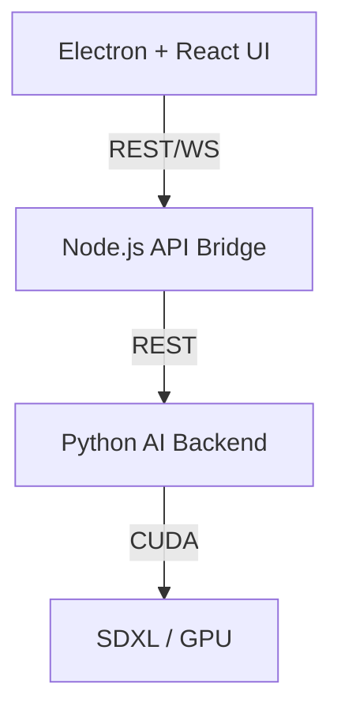

# Prune Juice: Engineering Notes

Technical implementation details for reviewers and hiring managers.

## 🏗️ Architecture

- **Why Electron + Python?**
  - **Reason**: Decoupling the heavyweight Python runtime from the UI ensures that UI interactions remain smooth (60fps) even during intensive image generation.
  - **System Stability**: If the inference process crashes due to VRAM overflow, it doesn't bring down the main application. The bridge handles process recovery.

## ⚡ Performance & ML Optimization

- **Runtime**: Python 3.10+ with Torch 2.6.0.
- **Attention Kernel**: Moved from xFormers to native **SDPA** (Scaled Dot Product Attention).
- **Latency Budget (Target vs Actual)**:
  - _Warm Loading_: 30s (Target 20s) - Currently loading SDXL via `diffusers` with `fp16` variants.
  - _Inference (25 steps)_: ~120s on RTX 3070 Mobile (Target < 90s).
- **Current Bottlenecks**:
  - VAE decoding latency.
  - Lack of quantization for 8GB VRAM cards (currently using full fp16).

## 🚀 Next Steps (Scaling to 1k+ Users)

If this were moving from Alpha to a production-grade 1.0 release:

1. **Auto-Launcher**: Implementing a binary wrapper to handle the automatic installation of dependencies (Python/CUDA/Node) to remove manual setup steps.
2. **Quantization (4-bit/8-bit)**: Implementing NF4 or bitsandbytes quantization to allow SDXL to run on 6GB and 4GB cards.
3. **Local LoRA Management**: Allow users to download and toggle artist-specific LoRAs for fine-tuned style control.
4. **Vector Search (RAG)**: Indexing your generated images and design assets to allow local "semantic search" of your own library.
5. **Remote Fallback**: Optional encrypted "cloud sync" or remote execution for users without high-end GPUs.

---

**Engineer Lens**: This project demonstrates the ability to bridge complex C++ backed ML runtimes with consumer-grade desktop application frameworks.
